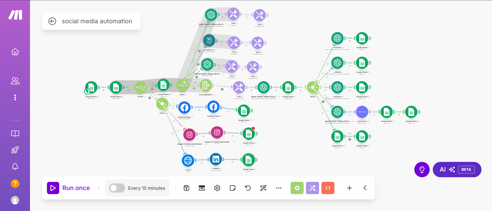

# Social Media Automation with Make.com + OpenAI

This project automates social media content creation and posting across multiple platforms using Make.com (formerly Integromat), OpenAI, Google Sheets, and direct API integrations. It helps maintain a consistent posting schedule while leveraging AI for engaging content generation.

# Work Overview

-----

## 🌐 Platforms Supported

- **Facebook Pages**
- **Instagram**
- **LinkedIn**
- **Google Sheets** (for sourcing content ideas)

-----

## 🛠️ Technologies Used

- **Make.com**
- **OpenAI GPT-4**
- **Google Sheets**
- **Facebook/LinkedIn/Instagram APIs**

-----

## 📚 How It Works

The automation workflow follows a streamlined process:

1. **Content Sourcing**: Content ideas are pulled from Google Sheets
1. **AI Generation**: OpenAI generates captions and hashtags
1. **Scheduling**: Posts are scheduled every 15 minutes
1. **Publishing**: Content is uploaded automatically to Facebook, Instagram, and LinkedIn

-----

🧠 AI-Powered Features
	•	Intelligent caption generation tailored for each platform.
	•	Automated hashtag recommendations for maximum reach.
	•	Optional voice-to-text support for faster content creation.

-----

## 🚀 Setup Guide

### Prerequisites

- Make.com account with advanced scenario support
- OpenAI API key
- Google account with Sheets access
- API access for Facebook, Instagram, and LinkedIn
- Content repository in Google Sheets

### Configuration Steps

1. **Prepare Google Sheets**:
- Set up your content database with columns for ideas, topics, and scheduling
- Ensure proper formatting for Make.com integration
1. **Configure Make.com Scenario**:
- Import the automation workflow
- Connect all required APIs and services
- Set up the 15-minute scheduling trigger
1. **API Integrations**:
- Connect Facebook Pages API
- Set up Instagram Business API
- Configure LinkedIn Company Pages API
- Test all connections
1. **OpenAI Integration**:
- Add your OpenAI API key
- Configure prompts for caption and hashtag generation
- Set content parameters for each platform
1. **Test and Deploy**:
- Run test posts to verify functionality
- Monitor initial automated posts
- Adjust settings as needed

-----

## 📈 Benefits

- **Time Efficiency**: Automates hours of manual content creation
- **Consistency**: Maintains regular posting schedule across all platforms
- **Quality**: AI-generated content tailored for each platform’s audience
- **Scalability**: Easily manage multiple social media accounts

-----

## 📜 License

This project is licensed under the MIT License. See the [LICENSE](LICENSE) file for more details.
